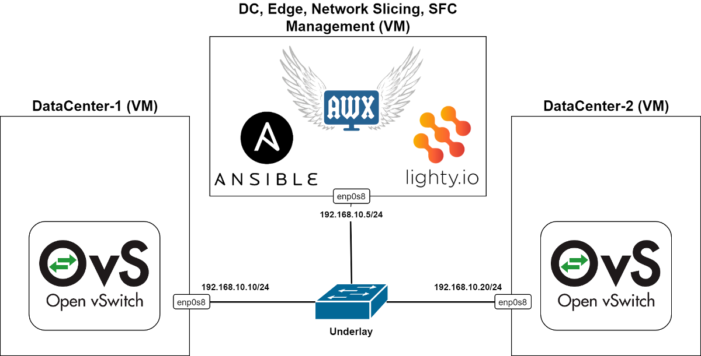

# DC tenant provisioning and SFC automation
This project implements Ansible playbooks and helper module using SDN controller
based on lighty.io with OpenFlow and OVSDB plugins. The controller is able to configure
instances of Open vSwitch used as virtual networking infrastructure in a multi-tenant DC
and for Service Function Chaining (SFC).

Implemented playbooks use universal configuration structure which defines servers or containers
of the tenant to be provisioned in two DCs and interconnection of the containers over VXLAN.
Configuration of each tenant can define also usage of Service Function (SF) which will be chained
with tenant's container using OpenFlow bridge.

Some interesting scenarios have been described in a blog (TODO add link to the blog) where the
playbooks from this project have been used with the topology show in the following picture:

    

### The workflow using playbooks directly by Ansible:

#### SET:
- ansible-playbook apb_set_tenant.yaml -v --extra-vars "@cfg/cfg_example.json"
- ansible-playbook apb_set_chaining.yaml -v --extra-vars "@cfg/cfg_example.json"
- ansible-playbook apb_set_flows.yaml -v --extra-vars "@cfg/cfg_example.json"
- ansible-playbook apb_set_bridge.yaml -v --extra-vars "@cfg/cfg_example.json"

#### DELETE:
- ansible-playbook apb_del_flows.yaml -v --extra-vars "@cfg/cfg_example.json"
- ansible-playbook apb_del_chaining.yaml -v --extra-vars "@cfg/cfg_example.json"
- ansible-playbook apb_del_tenant.yaml -v --extra-vars "@cfg/cfg_example.json"
